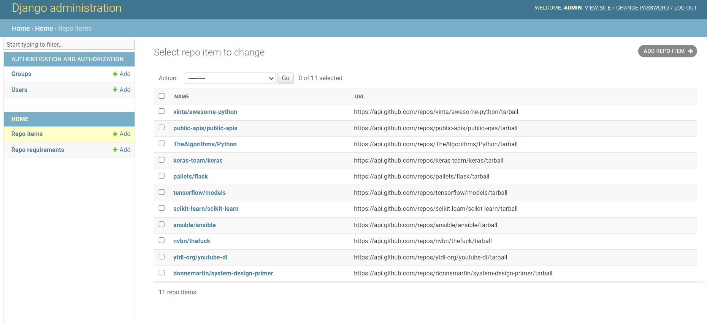
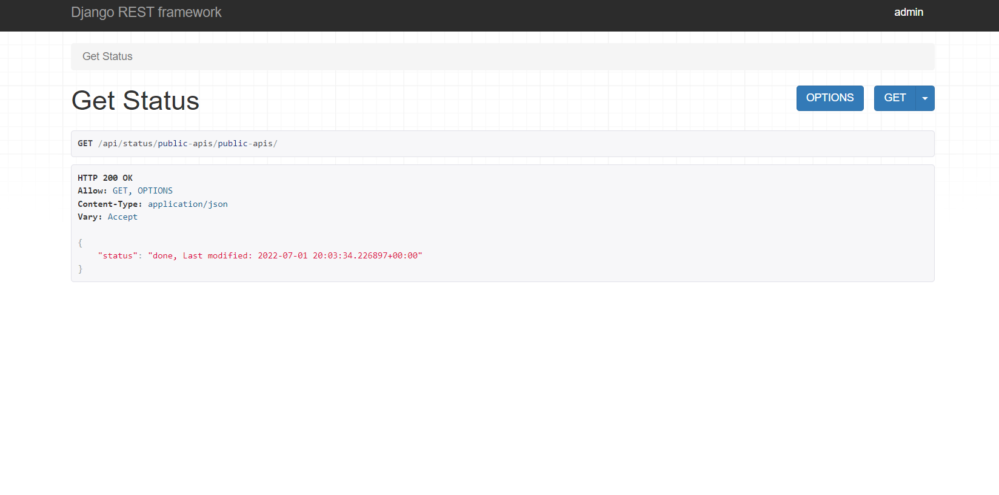
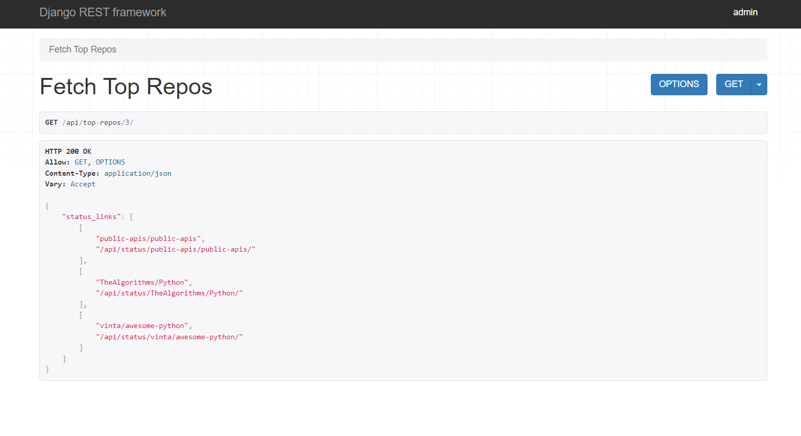

# Running through docker?

- `docker-compose build`
- `docker-compose up`

Worked but then had issues? try `docker-compose down --remove-orphans`
(This will cause all data to be lost)

# Running locally?
- have postgresql installed locally with a user/pass/db = test/test/test
- create venv using python 3.9
- pip install requirements
- have Redis and Celery services running
- change DB settings to point to localhost
- run migrations
- run server
- take some popcorn and enjoy

# Comments:
- No CRUD operations were requested hence I didn't use any serializers 
- For the client you can use any browser and swagger should be bundled as part of the site
- Utilized Django Admin to veirify data through UI 
- I created a database migration that creates an admin user to login to admin site (user/pass: admin/admin123)
- Every task status can be tracked by fetching the status of the repository

# Possible additions
- I did not adhear to th pep 8 line width for easier coding (and because I had issues with flake8).
- No testing but that can be done uppon request including a mock server.
- For simplicity I did not make credentials env vars but that is best practice!
- Since there was no requirement for operations on the DB I didn't use the ModelViewSet.
- For the same reason as above, I didn't use an API router to automatically handle the urls.
- Because of time constaint reasons I did not handle malicious and non-valid api calls (including 4**, 5**)
- Because of time constaint reasons I did not implement propper logging
- In real life project I like to organize an "apps" folder and a config folder as I don't like the default layout
- in real life since it's a many to many and not a dynamic field, cache should be used for all RepoRequirements and adding a flag reset on request (update=true), this can be done by using a custom model manager and caching the specific query
- The API requests should be POST (not GET) but this way it's easier to launch through the browser 
- I would've liked to spend another hour or two for setting up an email that gets sent each time a signal has
fired off for a status change of a RepoItem

- All of the above would likely take me a long time but if it's the difference between pass and fail
please let me know and I'll upgrade the project

# Screenshots

